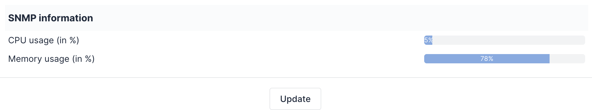

## Show CPU-Memory Network Device Usage

Restores the tab "SNMP" tab to display "**CPU usage (in %)**" and "**Memory usage (in %)**" for Network devices using GLPI Agent (ported from FusionInventory).

## Screenshot

## GLPI Agent modules

You can improve CPU/memory parsing by applying the following patches to GLPI Agent:

  * [#649](https://github.com/glpi-project/glpi-agent/pull/649): Cisco Switches.

## Building

To create a new release of this plugin automatically through GitHub Actions (Workflow), edit the file ``swcpuram.xml`` to include the new version tag (e.g. ``1.0.1``), GLPI compatbile version and download URL and create a new branch.

## Additional resources

* [Official website](https://github.com/eduardomozart/swcpuram)
* [Translations on Transifex service](https://www.transifex.com/eduardomozart/swcpuram/content/)
* [Issues](https://github.com/eduardomozart/swcpuram/issues)
